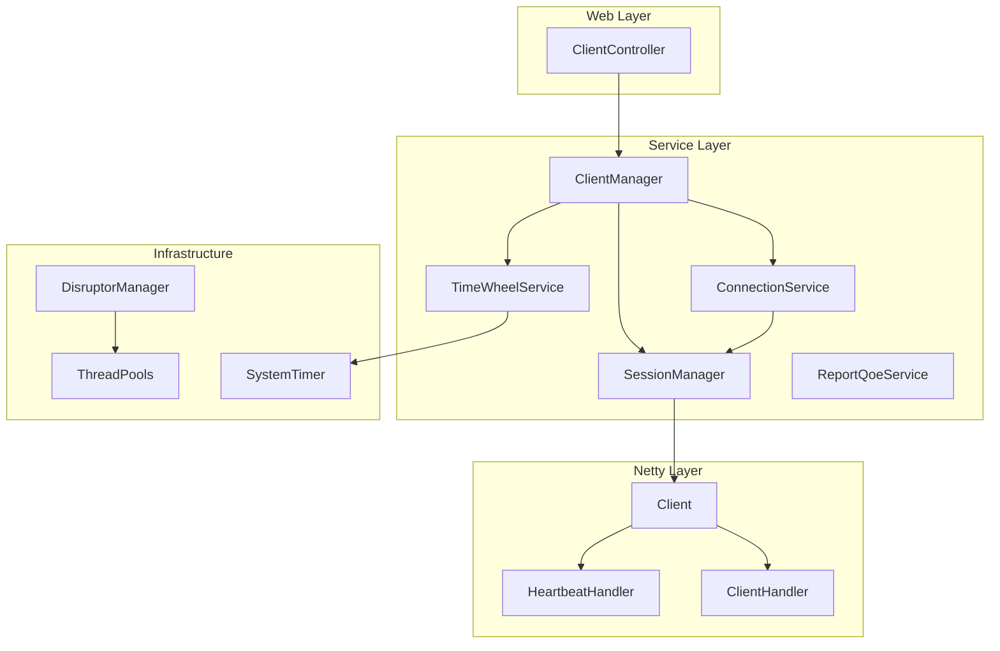
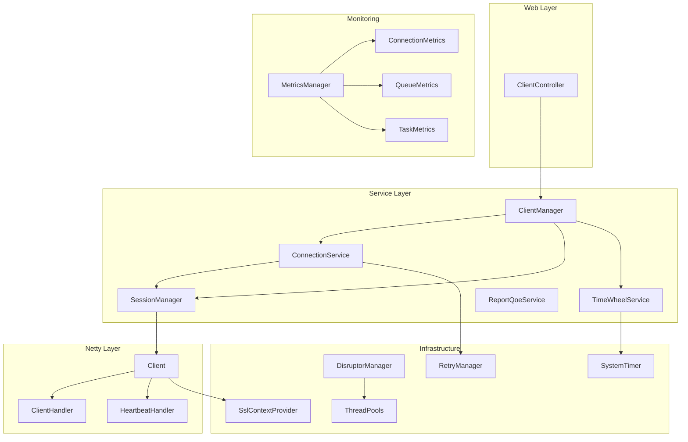

# Design Document: Netty Client Simulator Optimization

## Overview

本设计文档描述了 Netty 客户端模拟器项目的优化方案。优化涵盖依赖升级、连接管理、资源管理、异常处理、代码质量、监控增强、配置管理和测试覆盖等方面。

### 设计目标

1. **安全性**: 升级存在安全漏洞的依赖
2. **稳定性**: 增强连接管理和异常处理机制
3. **性能**: 优化资源使用和内存管理
4. **可维护性**: 改善代码结构和质量
5. **可观测性**: 完善监控指标体系

## Architecture

### 现有架构



### 优化后架构



## Components and Interfaces

### 1. 依赖升级组件

#### 1.1 POM 依赖变更

| 依赖 | 当前版本 | 目标版本 | 变更原因 |
|------|---------|---------|---------|
| fastjson | 1.2.83 | fastjson2 2.0.x | 安全漏洞修复 |
| disruptor | 3.3.6 | 4.0.0 | 性能提升 |
| jackson-databind | 2.18.2 | 由 BOM 管理 | 版本统一 |
| hutool-http | 5.8.36 | 移除 | 未使用 |

### 2. 连接管理组件

#### 2.1 RetryPolicy 接口

```java
public interface RetryPolicy {
    /**
     * 计算下次重试延迟时间
     * @param attemptNumber 当前重试次数
     * @return 延迟毫秒数，-1 表示不再重试
     */
    long getNextRetryDelay(int attemptNumber);
    
    /**
     * 是否应该重试
     * @param attemptNumber 当前重试次数
     * @param exception 发生的异常
     * @return 是否重试
     */
    boolean shouldRetry(int attemptNumber, Throwable exception);
}
```

#### 2.2 ExponentialBackoffRetryPolicy 实现

```java
public class ExponentialBackoffRetryPolicy implements RetryPolicy {
    private final int maxRetries;
    private final long initialDelayMs;
    private final long maxDelayMs;
    private final double multiplier;
    
    // 指数退避算法: delay = min(initialDelay * multiplier^attempt, maxDelay)
}
```

#### 2.3 SessionManager 接口优化

```java
public interface SessionManager {
    void addClient(String clientId, Client client);
    Optional<Client> getClient(String clientId);  // 返回 Optional
    Map<String, Client> getClientMap();
    int getClientMapSize();
    void removeClient(String clientId);  // 新增
    void shutdown();
}
```

### 3. 资源管理组件

#### 3.1 SslContextProvider

```java
@Component
public class SslContextProvider {
    private volatile SslContext sslContext;
    
    @PostConstruct
    public void init() {
        // 初始化并缓存 SslContext
    }
    
    public SslContext getSslContext() {
        return sslContext;
    }
}
```

#### 3.2 TimingThreadPool 优化

```java
@Override
protected void afterExecute(Runnable r, Throwable t) {
    try {
        // 原有逻辑
    } finally {
        startTime.remove();  // 清理 ThreadLocal
        super.afterExecute(r, t);
    }
}
```

### 4. 异常处理组件

#### 4.1 自定义异常体系

```java
public class ClientNotFoundException extends BusinessException {
    public ClientNotFoundException(String clientId) {
        super("Client not found: " + clientId);
    }
}

public class ConnectionException extends BusinessException {
    public ConnectionException(String message, Throwable cause) {
        super(message, cause);
    }
}
```

#### 4.2 Disruptor ExceptionHandler

```java
public class DisruptorExceptionHandler<T> implements ExceptionHandler<T> {
    @Override
    public void handleEventException(Throwable ex, long sequence, T event) {
        log.error("Disruptor event processing error, sequence: {}", sequence, ex);
    }
    
    @Override
    public void handleOnStartException(Throwable ex) {
        log.error("Disruptor start error", ex);
    }
    
    @Override
    public void handleOnShutdownException(Throwable ex) {
        log.error("Disruptor shutdown error", ex);
    }
}
```

### 5. 监控组件

#### 5.1 ConnectionMetrics

```java
@Component
public class ConnectionMetrics {
    private final MeterRegistry registry;
    private final AtomicInteger totalConnections;
    private final AtomicInteger activeConnections;
    
    public ConnectionMetrics(MeterRegistry registry) {
        this.registry = registry;
        this.totalConnections = registry.gauge("netty.connections.total", new AtomicInteger(0));
        this.activeConnections = registry.gauge("netty.connections.active", new AtomicInteger(0));
    }
}
```

#### 5.2 指标列表

| 指标名称 | 类型 | 描述 |
|---------|------|------|
| netty.connections.total | Gauge | 总连接数 |
| netty.connections.active | Gauge | 活跃连接数 |
| disruptor.queue.remaining | Gauge | 队列剩余容量 |
| timewheel.tasks.pending | Gauge | 待执行任务数 |
| threadpool.active.threads | Gauge | 活跃线程数 |
| threadpool.queue.size | Gauge | 队列大小 |

## Data Models

### 1. 配置模型优化

#### 1.1 ClientConfig

```java
@Data
@ConfigurationProperties(prefix = "client")
@Validated
public class ClientConfig {
    @NotBlank
    private String host;
    
    @Min(1) @Max(65535)
    private Integer port;
    
    private Boolean useTls = true;
    
    @Min(1)
    private Integer keepAlive = 235;
    
    @Min(1000)
    private Integer connectTimeoutMs = 5000;  // 新增
    
    @Min(1)
    private Integer maxRetries = 3;  // 新增
    
    private String sslCertPath;  // 新增
    private String sslKeyPath;   // 新增
}
```

#### 1.2 RetryConfig

```java
@Data
@ConfigurationProperties(prefix = "retry")
public class RetryConfig {
    private Integer maxRetries = 3;
    private Long initialDelayMs = 1000L;
    private Long maxDelayMs = 30000L;
    private Double multiplier = 2.0;
}
```

### 2. 响应模型

#### 2.1 统一响应格式

```java
@Data
@Builder
public class ApiResult<T> {
    private Integer code;
    private String message;
    private T data;
    private Long timestamp;
}
```


## Correctness Properties

*A property is a characteristic or behavior that should hold true across all valid executions of a system-essentially, a formal statement about what the system should do. Properties serve as the bridge between human-readable specifications and machine-verifiable correctness guarantees.*

### Property 1: 指数退避重试延迟计算

*For any* 重试次数 n（n >= 0），指数退避算法计算的延迟时间应满足公式：delay = min(initialDelay * multiplier^n, maxDelay)

**Validates: Requirements 2.1, 2.2**

### Property 2: SessionManager 获取不存在 Client 返回 Optional.empty

*For any* 不存在于 SessionManager 中的 clientId，调用 getClient 方法应返回 Optional.empty()，而非 null 或抛出异常

**Validates: Requirements 2.3**

### Property 3: SslContext 实例复用

*For any* 多个 Client 实例，当启用 SSL 时，它们应共享同一个 SslContext 实例（通过对象引用相等性验证）

**Validates: Requirements 3.1**

### Property 4: ThreadLocal 清理

*For any* 提交到 TimingThreadPool 的任务，任务执行完成后，startTime ThreadLocal 变量应被清理（值为 null）

**Validates: Requirements 3.2**

### Property 5: 连接异常转换为业务异常

*For any* 连接过程中发生的底层异常（如 IOException、TimeoutException），系统应将其包装为 ConnectionException 业务异常

**Validates: Requirements 4.1**

### Property 6: 获取不存在 Client 抛出特定异常

*For any* 需要获取 Client 并进行操作的场景，当 Client 不存在时，系统应抛出 ClientNotFoundException

**Validates: Requirements 4.2**

### Property 7: 时间轮任务失败重试

*For any* 执行失败的时间轮任务，如果配置了重试策略，系统应按照配置的重试次数和间隔进行重试

**Validates: Requirements 4.4**

### Property 8: 连接指标准确性

*For any* 连接状态变化（建立或断开），Micrometer 暴露的连接数指标应准确反映当前状态

**Validates: Requirements 6.1**

### Property 9: 队列指标准确性

*For any* Disruptor 队列的发布操作，队列剩余容量指标应准确反映当前可用空间

**Validates: Requirements 6.2**

### Property 10: 任务指标准确性

*For any* 时间轮任务执行，任务执行延迟和成功率指标应准确记录

**Validates: Requirements 6.3**

### Property 11: 线程池指标准确性

*For any* 线程池任务提交，活跃线程数和队列大小指标应准确反映当前状态

**Validates: Requirements 6.4**

### Property 12: 配置校验有效性

*For any* 无效的配置值（如负数端口、空主机名），应用启动时应抛出配置校验异常

**Validates: Requirements 7.1**

### Property 13: SessionManager CRUD 操作一致性

*For any* SessionManager 的增删查操作序列，操作结果应保持一致性（添加后可查询、删除后不可查询）

**Validates: Requirements 8.1**

### Property 14: TimingThreadPool 计时准确性

*For any* 提交到 TimingThreadPool 的任务，记录的执行时间应大于等于任务实际执行时间

**Validates: Requirements 8.2**

### Property 15: 时间轮任务调度准确性

*For any* 添加到时间轮的延迟任务，任务应在指定延迟时间后执行（允许一定误差范围）

**Validates: Requirements 8.3**

## Error Handling

### 1. 异常层次结构

```
BusinessException (基类)
├── ClientNotFoundException      - 客户端不存在
├── ConnectionException          - 连接相关异常
│   ├── ConnectionTimeoutException   - 连接超时
│   └── ConnectionRefusedException   - 连接被拒绝
├── ConfigurationException       - 配置异常
└── QueueFullException          - 队列满异常
```

### 2. 异常处理策略

| 异常类型 | 处理策略 | 是否重试 |
|---------|---------|---------|
| ConnectionTimeoutException | 记录日志，触发重试 | 是 |
| ConnectionRefusedException | 记录日志，触发重试 | 是 |
| ClientNotFoundException | 返回错误响应 | 否 |
| ConfigurationException | 启动失败 | 否 |
| QueueFullException | 记录日志，丢弃或阻塞 | 可配置 |

### 3. 全局异常处理器

```java
@RestControllerAdvice
public class GlobalExceptionHandler {
    
    @ExceptionHandler(ClientNotFoundException.class)
    public ApiResult<Void> handleClientNotFound(ClientNotFoundException e) {
        return ApiResult.fail(404, e.getMessage());
    }
    
    @ExceptionHandler(BusinessException.class)
    public ApiResult<Void> handleBusinessException(BusinessException e) {
        return ApiResult.fail(500, e.getMessage());
    }
}
```

## Testing Strategy

### 1. 测试框架选择

- **单元测试**: JUnit 5 + Mockito
- **属性测试**: jqwik (Java Property-Based Testing)
- **集成测试**: Spring Boot Test

### 2. 属性测试库配置

```xml
<dependency>
    <groupId>net.jqwik</groupId>
    <artifactId>jqwik</artifactId>
    <version>1.8.2</version>
    <scope>test</scope>
</dependency>
```

### 3. 测试分类

#### 3.1 单元测试

- SessionManager 增删查操作
- TimingThreadPool 计时功能
- 指数退避算法计算
- 配置属性绑定

#### 3.2 属性测试

每个属性测试必须：
- 运行至少 100 次迭代
- 使用注释标记对应的正确性属性
- 格式：`**Feature: netty-client-optimization, Property {number}: {property_text}**`

示例：

```java
@Property(tries = 100)
// **Feature: netty-client-optimization, Property 1: 指数退避重试延迟计算**
void exponentialBackoffDelayCalculation(
    @ForAll @IntRange(min = 0, max = 10) int attemptNumber,
    @ForAll @LongRange(min = 100, max = 5000) long initialDelay,
    @ForAll @DoubleRange(min = 1.5, max = 3.0) double multiplier,
    @ForAll @LongRange(min = 10000, max = 60000) long maxDelay
) {
    ExponentialBackoffRetryPolicy policy = new ExponentialBackoffRetryPolicy(
        10, initialDelay, maxDelay, multiplier
    );
    
    long expectedDelay = Math.min(
        (long)(initialDelay * Math.pow(multiplier, attemptNumber)),
        maxDelay
    );
    
    assertThat(policy.getNextRetryDelay(attemptNumber)).isEqualTo(expectedDelay);
}
```

#### 3.3 集成测试

- 应用启动测试
- 配置加载测试
- 优雅关机测试

### 4. 测试覆盖目标

| 模块 | 行覆盖率目标 | 分支覆盖率目标 |
|------|------------|--------------|
| 核心服务 | 80% | 70% |
| 工具类 | 90% | 80% |
| 配置类 | 70% | 60% |

### 5. 测试命名规范

```
{被测方法}_{测试场景}_{预期结果}
```

示例：
- `getClient_whenClientExists_returnsOptionalWithClient`
- `getClient_whenClientNotExists_returnsEmptyOptional`
- `calculateDelay_withValidAttempt_returnsCorrectDelay`
